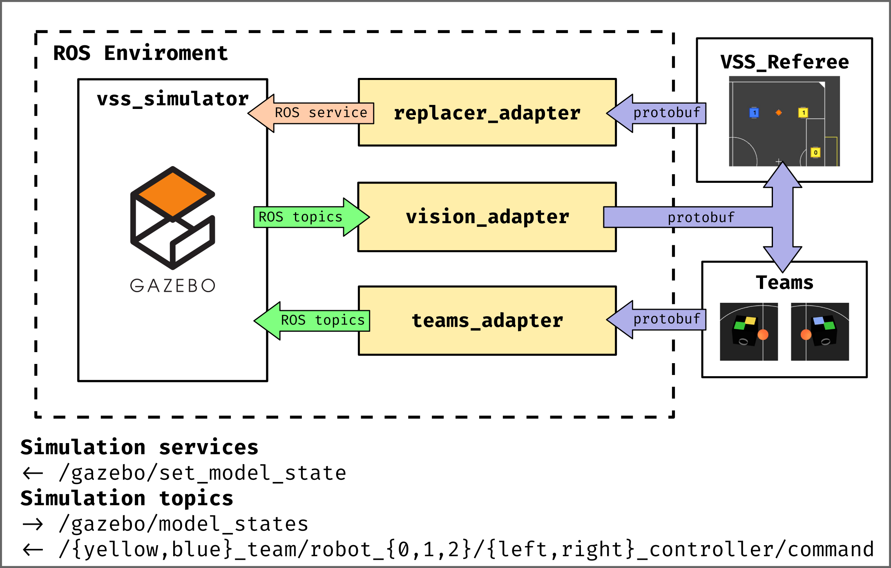
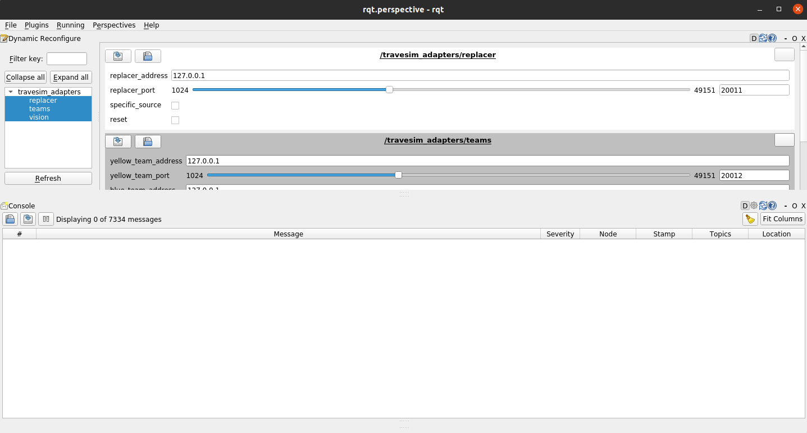

<h1 align="center">🥅 TraveSim Adapters 🔌</h1>
<p align="center">Protobuf adapter layer for TraveSim project </p>

<p align="center">


</p>

This project provides an adapter layer to non-ROS projects to work with [TraveSim](https://github.com/ThundeRatz/travesim).

## 🏗️ Architecture



## ▶️ Running

It is necessary to clone the project and [TraveSim](https://github.com/ThundeRatz/travesim) inside the `src` directory of a catkin workspace. To create a workspace, refer to [this link](http://wiki.ros.org/catkin/Tutorials/create_a_workspace).

Than compile all the projects running the following command in the root of the catkin workspace:

```bash
catkin_make
```

Finally, to run the adapters along with TraveSim simply use the adapters lanchfile:

```bash
roslaunch travesim_adapters adapters.launch
```

## 🔧 Configuration

The adapters can be configured while launching the ROS nodes with roslaunch parameters or while the nodes are already running with dynamic reconfigure.

### 🚀 Roslaunch Parameters

There are three parameters that may be passed to the `adapters.launch` launcfile:

Parameter         | Description                                                     | Default value
:---------------: | :-------------------------------------------------------------- | :------------:
`robots_per_team` | Number of robots per team, should be `3` or `5`.                | `3`
`gui`             | Whether to show TraveSim GUI or run it headless.                | `true`
`sound`           | Whether to play sound while spawning robots in TraveSim or not. | `true`

For example:

```bash
roslaunch travesim_adapters adapters.launch robots_per_team:=5
```

### 💫 Dynamic Reconfigure

There are some parameters that can be configured for each adapter node while they are running with dynamic reconfigure through the rqt interface.



#### 📢 Referee

Parameter          | Description | Default value
:----------------: | :---------- | :------------:
`replacer_address` | Unicast addresses of the referee adapter receiver, must be in the block [127.0.0.0/8](https://www.iana.org/assignments/iana-ipv4-special-registry/iana-ipv4-special-registry.xhtml). | `"127.0.0.1"`
`replacer_port`    | Port of the referee adapter receiver, must be in the range [1024 - 49151](https://www.iana.org/assignments/service-names-port-numbers/service-names-port-numbers.xhtml). | `20011`
`specific_source`  |Whether the referee adapter should only receive from one source only or not. If this option is enabled, the first sender to communicate with the adapter will be set as the source and receiving anything from other programs, except this first program, will throw an error message. | `false`
`reset`            | "Button" to reset all protobuf communication. Useful when `specific_source` is enabled and you want to reset who is communicating with the adapter. | `false`

Observation: If the VSSReferee is restarted, its sender address will have changed, so if the `specific_source` option is enabled, it is necessary to reset the protobuf communication with the `reset` option.

#### 🤖 Teams

Parameter             | Description | Default value
:-------------------: | :---------- | :------------:
`yellow_team_address` | Unicast addresses of the yellow team receiver from the teams adapter, must be in the block [127.0.0.0/8](https://www.iana.org/assignments/iana-ipv4-special-registry/iana-ipv4-special-registry.xhtml). | `"127.0.0.1"`
`yellow_team_port`    | Port of the yellow team receiver from the teams adapter, must be in the range [1024 - 49151](https://www.iana.org/assignments/service-names-port-numbers/service-names-port-numbers.xhtml). | `20012`
`blue_team_address`   | Unicast addresses of the blue team receiver from the teams adapter, must be in the block [127.0.0.0/8](https://www.iana.org/assignments/iana-ipv4-special-registry/iana-ipv4-special-registry.xhtml). | `"127.0.0.1"`
`blue_team_port`      | Port of the blue team receiver from the teams adapter, must be in the range [1024 - 49151](https://www.iana.org/assignments/service-names-port-numbers/service-names-port-numbers.xhtml). | `20013`
`specific_source`     | Whether the teams adapter should only receive from one source only for each team or not. If this option is enabled, the first sender to communicate with the adapter will be set as the source and receiving anything from other programs, except this first program, will throw an error message. | `false`
`reset`               | "Button" to reset all protobuf communication. Useful when `specific_source` is enabled and you want to reset who is communicating with the adapter. | `false`

Observation: If the any of the teams is restarted, its sender address will have changed, so if the `specific_source` option is enabled, it is necessary to reset the protobuf communication with the `reset` option.

#### 📸 Vision

Parameter             | Description | Default value
:-------------------: | :---------- | :------------:
`multicast_address`   | Multicast address of the vision adapter, must be in the range [224.0.0.0 through 239.255.255.255](https://www.iana.org/assignments/multicast-addresses/multicast-addresses.xhtml). | `"224.0.0.1"`
`multicast_port`      | Port of the vision adapter, must be in the range [1024 - 49151](https://www.iana.org/assignments/service-names-port-numbers/service-names-port-numbers.xhtml). | `10002`
`reset`               | "Button" to reset all protobuf communication. | `false`

---


