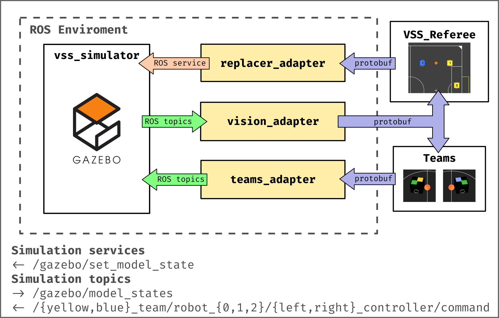

<h1 align="center">🥅 TraveSim Adapters 🔌</h1>

Protobuf adapter layer for TraveSim project 

This project provides an adapter layer to non-ROS projects to work with [TraveSim](https://github.com/ThundeRatz/travesim)

